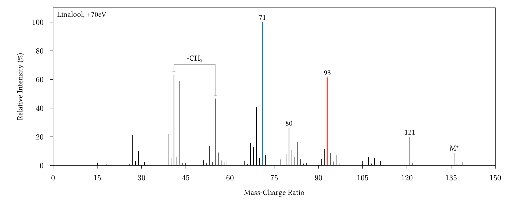

# The `ionio-illustrate` package
<div align="center">
<a href="https://github.com/jamesxx/ionio-illustrate/blob/master/LICENSE">
  
</a>
<a href="https://github.com/typst/packages/tree/main/packages/preview/ionio-illustrate">
  
</a>
<a href="https://github.com/JamesxX/ionio-illustrate/tags">

</a>
</div>

This package implements a Cetz chart-like object for displying mass spectrometric data in Typst documents. It allows for individually styled mass peaks, callouts, titles, and mass calipers.

## Usage

```typst
#import "@preview/ionio-illustrate:0.1.0": *
#let data = csv("isobutelene_epoxide.csv")

#let ms = mass-spectrum(massspec, args: (
  size: (12,6),
  range: (0,100),
)) 

#figure((ms.display)(ms))
```

## Example output
